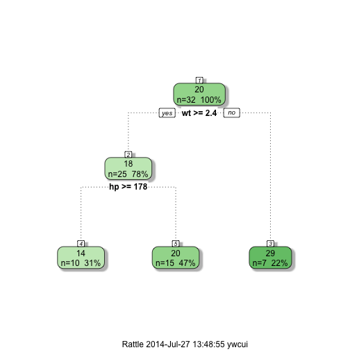

## The Motor Trend Dataset

- The motor trend dataset (mtcars) is a build in dataset in R.
It contains fuel consumption and 10 aspects of automobile design and performance for 32 automobiles.

- Let's load the dataset into R and look at the first three observations:

```r
data(mtcars)
head(mtcars,3)
```

```
##                mpg cyl disp  hp drat    wt  qsec vs am gear carb
## Mazda RX4     21.0   6  160 110 3.90 2.620 16.46  0  1    4    4
## Mazda RX4 Wag 21.0   6  160 110 3.90 2.875 17.02  0  1    4    4
## Datsun 710    22.8   4  108  93 3.85 2.320 18.61  1  1    4    1
```

- We will build a tool that allows exploratory analysis of the mtcars dataset. You can find the shiny application online [here](http://ywcui.shinyapps.io/MTcar_DecisionTree/).

--- .class #id 

## Decision Tree 

- Decision tree is a decision support tool that uses a tree-like graph to understand consequences of decisions. More information can be found on this [wikipage](http://en.wikipedia.org/wiki/Decision_tree). 
- We used the rpart package to fit decision tree model


```r
require(rpart)
modDT <- rpart(mpg ~ wt + hp, data = mtcars)
```

- The formula "mpg ~ wt + hp" informs rpart to use weight (wt) and horsepower (hp) as predictors to explain the difference of fuel consumption (mpg). 

- In the online shiny application, you can specify the predictors and the outcomes from the side panel.

--- .class #id 

## Understanding the Decision Tree

Let's take a look at the decision tree model returned by rpart:

```r
print(modDT)
```

```
## n= 32 
## 
## node), split, n, deviance, yval
##       * denotes terminal node
## 
## 1) root 32 1126.00 20.09  
##   2) wt>=2.393 25  320.40 17.59  
##     4) hp>=177.5 10   48.54 14.28 *
##     5) hp< 177.5 15   89.53 19.79 *
##   3) wt< 2.393 7   89.81 29.03 *
```

The resulting decision tree has 3 levels and 5 nodes. The decision criteria, the number of observations processed by the node, the deviance and the average value of mpg is shown for each node. 

--- .class #id 
## Display Decision Tree

- To visualize the decision tree, we used the fancyRpartPlot function from the rattle package. 
- The same decision tree is plotted in a nice format here. The color of the node indicates the average outcome value (mpg) for that node.

```r
fancyRpartPlot(modDT)            
```

 
